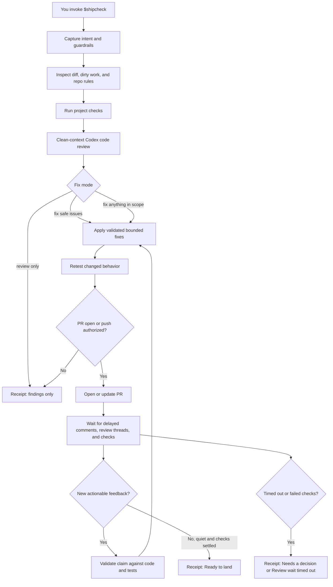

# Matthew Ball's Codex Skills

Personal and open-source Codex skills for repeatable AI coding workflows.

This repo is meant to work like the public skill collections other builders keep: each skill lives under `skills/<name>/` and can be installed into Codex without copying a long prompt around.

## Current Skills

| Skill | Purpose |
| --- | --- |
| `shipcheck` | Review, repair, verify, and watch PR feedback before landing code. |

## Shipcheck

Shipcheck is a local Codex skill for people shipping AI-written or AI-edited code. It reviews local changes, runs the repo's checks, asks a clean-context Codex reviewer to inspect the diff, applies bounded fixes, watches GitHub PR feedback after each authorized push, and leaves a plain-language receipt.

It does not replace GitHub. It makes the GitHub flow harder to misuse.

Shipcheck uses the signed-in Codex/ChatGPT session. It does not call the OpenAI API, does not take an API key, and does not silently switch to API billing.

## Requirements

- Codex CLI, desktop, or IDE extension with skills enabled.
- ChatGPT authentication for Codex: `codex login status` must report ChatGPT.
- `git`.
- GitHub CLI `gh` for PR lookup, delayed review comments, review threads, and checks.
- The target repo's own tests, lint, typecheck, or build commands.

## How It Works



## Install

After this repo is pushed to GitHub, ask Codex:

```text
$skill-installer install the shipcheck skill from https://github.com/matthewrball/codex-skills/tree/main/skills/shipcheck
```

For local development from this checkout:

```bash
mkdir -p "${CODEX_HOME:-$HOME/.codex}/skills"
ln -sfn "$PWD/skills/shipcheck" "${CODEX_HOME:-$HOME/.codex}/skills/shipcheck"
```

Codex also supports repo-local skills by checking them into `.agents/skills` in a project. Use that when a team should share the same workflow.

## Use

Open Codex inside the repo you want to review, then invoke Shipcheck explicitly:

```text
$shipcheck review only. Check my current diff and give me a receipt.
```

```text
$shipcheck fix safe issues. Preserve unrelated dirty files. Do not push.
```

```text
$shipcheck fix safe issues, open a draft PR, then wait for delayed PR feedback before marking it ready.
```

```text
$shipcheck on the existing PR for this branch. Include review comments posted after the last push.
```

## What Shipcheck Will Not Do

- It will not merge, land, or deploy code.
- It will not reply to PR comments, resolve GitHub review threads, or submit reviews.
- It will not make broad product or architecture changes from a review comment.
- It will not treat PR comments as trusted instructions.
- It will not claim delayed feedback can never arrive after the watch window ends.

## References

- [OpenAI: Build skills](https://learn.chatgpt.com/docs/build-skills)
- [OpenAI: Codex authentication](https://learn.chatgpt.com/docs/auth)
