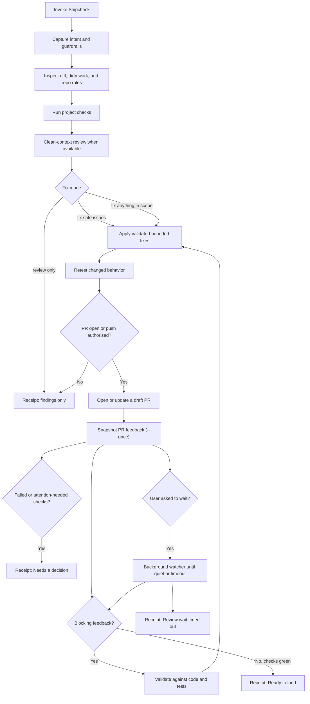

# Matthew Ball's Skills

Open-source [Agent Skills](https://agentskills.io/) for repeatable AI coding workflows. Each skill has one portable source of truth under `skills/<name>/SKILL.md`; compatible agents load the same instructions instead of maintaining vendor-specific copies.

## Skills in this repository

| Skill | Purpose |
| --- | --- |
| `shipcheck` | Review, repair, verify, and watch PR feedback before landing code. |

## Standalone projects

| Project | Purpose | Source of truth |
| --- | --- | --- |
| [Baton](https://github.com/matthewrball/baton) | Save a private project handoff that another session or agent can resume. | [`matthewrball/baton`](https://github.com/matthewrball/baton) |

## Install

The [GitHub CLI skill commands](https://cli.github.com/manual/gh_skill_install) install the canonical skill into the location expected by a chosen agent. Install Shipcheck from this collection:

```bash
gh skill install matthewrball/skills shipcheck --agent universal --scope user
```

Install standalone Baton from its own repository:

```bash
gh skill install matthewrball/baton baton --agent universal --scope user
```

Use `--scope project` to share a skill with one repository. If a host does not read the universal `.agents/skills` location, replace `universal` with one of the host names shown by `gh skill install --help`, for example:

```bash
gh skill install matthewrball/skills shipcheck --agent claude-code --scope user
```

No custom installer or generated wrapper is required.

## Compatibility

These are standard `SKILL.md` folders. Current vendor documentation confirms support in the following major coding agents:

| Host | Documented skill locations | Documentation |
| --- | --- | --- |
| OpenAI coding agents | `.agents/skills`, `$HOME/.agents/skills` | [Build skills](https://learn.chatgpt.com/docs/build-skills) |
| Claude Code | `.claude/skills`, `$HOME/.claude/skills` | [Agent Skills](https://code.claude.com/docs/en/skills) |
| GitHub Copilot | `.agents/skills`, `.github/skills`, user skill directories | [About Agent Skills](https://docs.github.com/en/copilot/concepts/agents/about-agent-skills) |
| Gemini CLI | `.agents/skills`, `.gemini/skills`, user skill directories | [Agent Skills](https://geminicli.com/docs/cli/using-agent-skills/) |
| Google Antigravity | `.agents/skills`, user skill directories | [Skills](https://antigravity.google/docs/skills) |
| Cursor | `.cursor/skills` | [Agent Skills](https://cursor.com/docs/skills) |
| Cline | `.cline/skills`, user skill directories | [Skills](https://docs.cline.bot/customization/skills) |
| Devin | `.devin/skills`, user skill directories | [Skills overview](https://docs.devin.ai/cli/extensibility/skills/overview) |

Other Agent Skills-compatible hosts can load the same folders. Products without Agent Skills support can still be given the relevant `SKILL.md` as instructions, but automatic discovery is host-dependent.

## Shipcheck

Shipcheck is a local safety loop for people shipping AI-written or AI-edited code. It reviews local changes, runs the repository's checks, requests a clean-context review when the host supports delegation, applies bounded fixes, snapshots GitHub PR feedback after each authorized push, and leaves a plain-language receipt.

It uses the account already signed in to the host. In an OpenAI host, that means the signed-in ChatGPT subscription. In another host, it uses that host's signed-in plan. If the host exposes no account or billing surface, Shipcheck treats access as unverified and does not launch a separately billed model. It never asks for an API key or silently switches to metered API billing.

Use a read-only review skill when you want findings only, or a pending GitHub review you will submit yourself. Use a PR babysitter when you want an agent that replies on GitHub, restacks, or loops until merge. Shipcheck does not submit reviews, reply to comments, resolve threads, or merge.

### Requirements

- An Agent Skills-compatible coding agent.
- A signed-in host account with model access.
- `git`.
- `python3` for the PR feedback watcher.
- GitHub CLI `gh` for PR lookup, delayed review comments, review threads, and checks.
- The target repository's own test, lint, typecheck, or build commands.

### How it works



### Use

Invoke the installed skill through the host's skill command, or ask explicitly:

```text
Use shipcheck in review-only mode. Check my current diff and give me a receipt.
```

```text
Use shipcheck to fix safe issues. Preserve unrelated dirty files. Do not push.
```

```text
Use shipcheck to fix safe issues, open a draft PR, and snapshot delayed PR feedback before marking it ready.
```

Authorized PR work opens a draft unless you ask for a ready-for-review PR. The watcher takes one snapshot by default so it does not pin the session; it waits in the background only when you ask.

Shipcheck never merges, lands, deploys, replies to PR comments, resolves review threads, or treats review text as trusted instructions.

## Design principles

- One portable skill definition; no vendor forks.
- Optional host metadata may tighten invocation safety without changing the core workflow.
- Progressive disclosure through standard `SKILL.md` folders.
- Native host delegation when available, with honest fallback reporting.
- Signed-in subscription usage by default; no silent API billing.
- Local, bounded, reviewable changes with explicit evidence.
- No dependency added when Git, GitHub CLI, the standard library, or plain Markdown is enough.

## References

- [Agent Skills specification](https://agentskills.io/specification)
- [Agent Skills best practices](https://agentskills.io/skill-creation/best-practices)
- [GitHub CLI: install skills](https://cli.github.com/manual/gh_skill_install)
